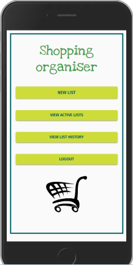
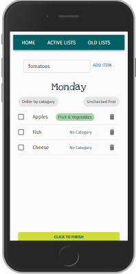

# Backend Project "Shopping list" with Node.js and Typescript

## 📜Description 

This is the backend for a simple shopping list app, where users can log in and create a shopping list or lists. 
The project is a study of typescript usage and part of a full stack application. 

**The frontend for the app can be found here:**

[Shoppinglist frontend](https://github.com/kbastamow/Shoppinglist_front_Typescript)

# Table of contents

- [Tech and tools](#-tech-and-tools)
- [Project structure](#-project-structure)
- [Future development](#-future-development)
- [Author](#-author)
- [Acknowledgements](#acknowledgements)
- [Frontend peek](#frontend-peek)

## 💻 Tech and tools 

- Node.js and Express
- MySQL database
- Typeorm as the ORM
- Express-validator to validate requests from client (only example usage)
- Bcrypt & JSON Webtoken for password security and user validation

🔨 Dev:
- Eslint & Prettier for linting

## 🌵 Project structure 
At the root we have **index.ts**.

**Config** folder holds the database connection.

**Dist** folder is where js files are created on compilation.

**Src** holds the files that are worked on and has the following structure:

    SRC: 

    ├── controllers 
    │   ├── CategoryController.ts 
    │   ├── ItemController.ts 
    │   ├── ListController.ts 
    │   └── UserController.ts 
    │
    ├── entities 
    │   ├── category.entity.ts 
    │   ├── item.entity.ts 
    │   ├── list.entity.ts 
    │   └── user.entity.ts 
    │
    ├── interfaces 
    │   ├── IAuthRequest.ts 
    │   └── IJwtPayload.ts 
    │ 
    ├── middlewares 
    │   ├── authentication 
    │   │   └── authentication.ts 
    │   │
    │   └── validators 
    │       └── userValidator.ts 
    │
    └── routes
        ├── categories.ts
        ├── items.ts
        ├── lists.ts
        └── users.ts

where **controllers** holds the logic for the endpoints; **entities** are Typeorm models for the database tables; **interfaces** holds type definitions; **middlewares** contains user authentication code through token, and validators for client requests; and finally, endpoint paths are defined in **routes** .

## 🔜 Future development 
The following points could be added in the future:

- [ ] Possibility for users to include their own categories
- [ ] Email confirmation for registration
- [ ] Middleware that checks ownership of lists
- [ ] Admin roles and related editing possibilities 

## ©️ Author
KBastamow

## Acknowledgements

The Shopping List full stack app was built following this [Typescript course on Udemy](https://www.udemy.com/course/typescript-course/) and uses the stack and structure of the course project. Nevertheless, the project idea and implementation are mine alone. 

## Frontend peek 
[Shoppinglist frontend](https://github.com/kbastamow/Shoppinglist_front_Typescript)

